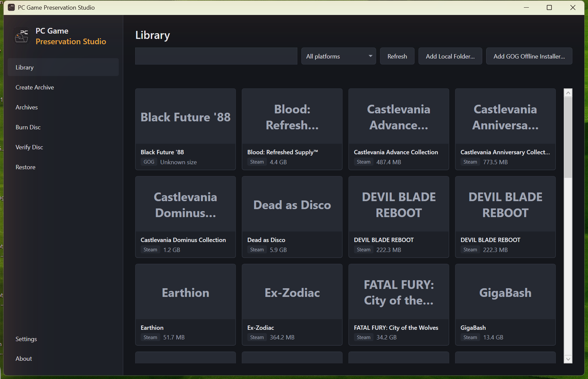
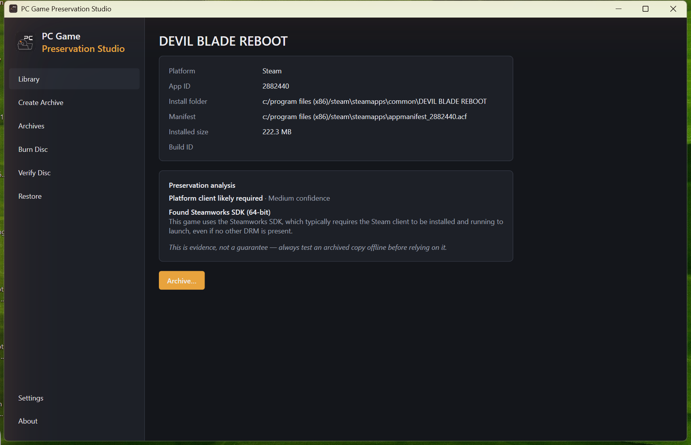
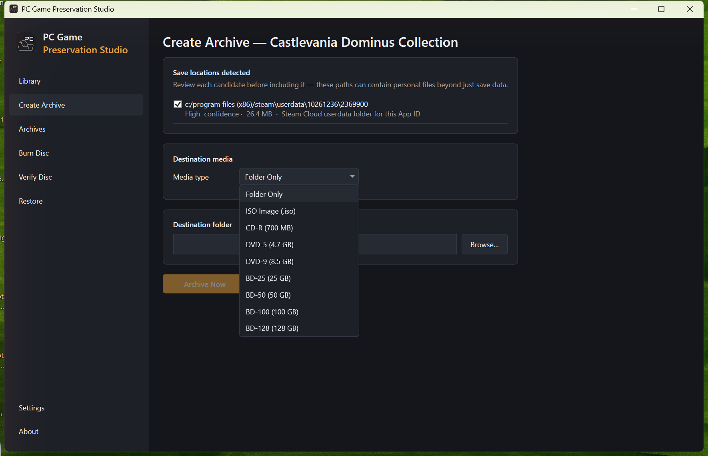
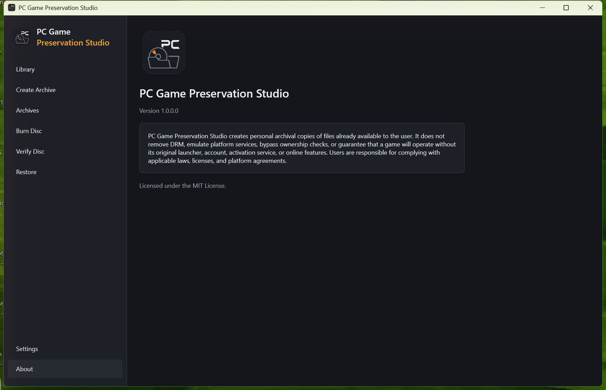

# PC Game Preservation Studio

An open-source Windows desktop app for creating **personal archival copies**
of PC games you legally own, sourced from Steam (installed files), GOG
(installed games or official offline installers), or local folders. Archives
can be written to a folder, a UDF ISO image, or burned to optical disc, with
SHA-256 checksums and a restore workflow.

## Screenshots

| | |
|---|---|
|  |  |
|  |  |

## What this project is not

PC Game Preservation Studio does **not** bypass DRM, patch executables,
emulate platform services (Steam, GOG Galaxy, etc.), remove account
requirements, or otherwise facilitate piracy. It only copies files you
already have on disk, records checksums and metadata, and helps you restore
them later. It honestly reports whether a restored game will likely still
require its original launcher, account, or online activation — it never
guarantees a game will work offline.

> PC Game Preservation Studio creates personal archival copies of files
> already available to the user. It does not remove DRM, emulate platform
> services, bypass ownership checks, or guarantee that a game will operate
> without its original launcher, account, activation service, or online
> features. Users are responsible for complying with applicable laws,
> licenses, and platform agreements.

## Status

Early development. Currently implemented:

- **Phase 1 — App shell**: WPF navigation, dependency injection, structured
  logging, settings, first-run flow, mock game library, empty archive
  catalog.
- **Phase 2 — Steam detection**: Steam library/registry detection,
  `libraryfolders.vdf` and `appmanifest_*.acf` parsing, game detail view,
  manual local-folder source.
- **Phase 3 — Archive builder**: save-location detection (Documents\My Games,
  AppData, Saved Games, Steam Cloud userdata, etc.), SHA-256 checksums,
  metadata generation, folder-based archive building and verification, all
  wired into a Create Archive flow from the game detail page.
- **Phase 4 — Media planning**: CD/DVD/BD capacity and safety-margin
  calculations, a media-type selector with a live capacity preview, and
  multi-disc splitting (`DISC_01\`, `DISC_02\`, ...) that never splits a
  single file across discs. When the chosen media is an actual physical
  optical disc (CD-R, DVD-5/9, BD-25/50/100/128), each `DISC_NN\` folder is
  then converted straight into its own `DISC_NN.iso`, so a multi-disc archive
  is immediately ready to hand to Burn Disc — no manual "make this an ISO"
  step required.
- **Phase 5 — GOG support**: installed-GOG-game detection (Windows registry,
  no Galaxy account or session access), a "Create Archive from GOG
  Installers" flow that groups official offline installer files (base game,
  DLC, patches, soundtracks, manuals) by filename before archiving, and
  GOG-specific preservation ratings (Excellent for offline installers,
  which are DRM-free by design; Good for installed-game copies).
- **Phase 6 — ISO creation**: an "ISO Image (.iso)" destination that detects
  a user-installed `oscdimg.exe` (Windows ADK) and converts a built archive
  into a UDF ISO. This app never bundles `oscdimg.exe` — if it isn't found,
  the folder archive is kept intact with a clear message explaining how to
  install the ADK or point Settings at an existing copy.
- **Phase 7 — Disc burning**: a "Burn Disc" page burns an already-built ISO
  to a detected optical drive via IMAPI2, and a "Verify Disc" page reads a
  burned disc back and checks it against its recorded checksums. Confirmed
  against real Blu-ray burner hardware. Only burns to blank media — writing
  onto already-recorded media isn't supported and is refused up front (see
  [`docs/BURNING_BACKENDS.md`](docs/BURNING_BACKENDS.md) for why).
- **Phase 8 — Restore**: a Restore page (also reachable via "Restore…" on
  any Archives entry) always re-verifies an archive against its checksums
  first and refuses to proceed if that fails, then copies game files to a
  destination you choose, save locations back to their recorded (or
  redirected) paths, and platform files (e.g. a Steam manifest) to a
  clearly-labeled subfolder for you to place yourself — restoring never
  grants or transfers platform ownership. Existing files at a destination
  are left alone unless you ask to overwrite them.
- **Preservation analysis**: the game detail page reports DRM/launcher
  evidence found in a game's install folder — known Steamworks, Ubisoft
  Connect, EA Desktop/Origin, Epic Online Services, and similar marker
  files. This only checks file names; it never opens, executes, or
  disassembles a game's executables, and every result is a
  confidence-qualified label ("likely", "may be required") backed by the
  specific evidence found, never a certain "has DRM" verdict.

Everything else (packaging) is **not yet implemented** and is labeled
"Coming Soon" in the app. See
[`docs/ARCHITECTURE.md`](docs/ARCHITECTURE.md) for the full roadmap.

## Requirements

- Windows 10 or 11, x64
- [.NET 8 SDK](https://dotnet.microsoft.com/download/dotnet/8.0) to build

## Building

```powershell
dotnet build
dotnet test
dotnet run --project src/PcGamePreservationStudio.App
```

## Project layout

See [`docs/ARCHITECTURE.md`](docs/ARCHITECTURE.md).

## License

[MIT](LICENSE)
